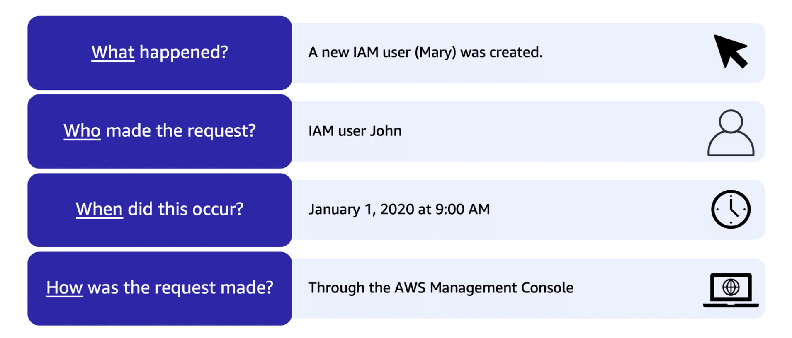
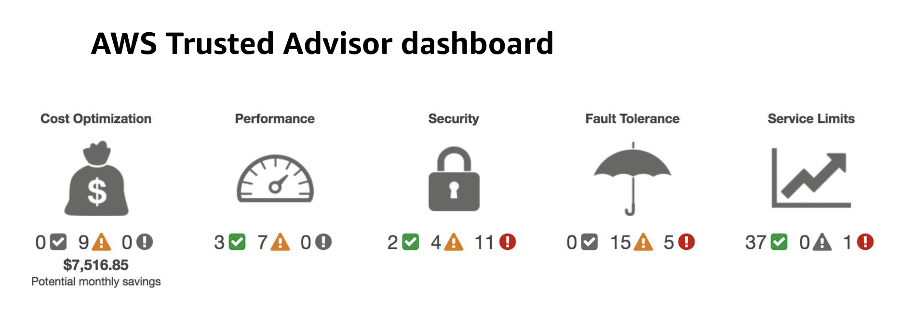

Content 

1. Amazon Cloudwatch
	1. Cloudwatch Alarms
	2. Cloudwatch Logs
	3. Cloudwatch Events ( EventBridge )
	4. Cloudwatch Dashboard
2. AWS CloudTrail
3. AWS Trust Advisor
   
------------------------------------------------------------------------

1. Amazon Cloudwatch
   
   Amazon CloudWatch ဆိုတာ AWS (Amazon Web Services) က ပေးတဲ့ monitoring နဲ့ management service တစ်ခုပါ။ CloudWatch ကို အသုံးပြုရင် AWS resources တွေကို နဲ့ application တွေကို real-time monitoring လုပ်နိုင်ပါတယ်။
   
   Cloudwatch က metrics ကို သုံးပါတယ်။ Metrics ဆိုတာကတော့ အချိန်တိုင်းမှာ စစ်ဆေးထားတဲ့ data point တွေကို အချိန်ကြာလာတာနဲ့အမျှ စုစည်းထားတဲ့ အချက်အလက်တွေပါပဲ။ ဥပမာ- CPU utilization, disk I/O, network traffic အစရှိတဲ့ AWS resources ရဲ့ metrics တွေက AWS အတွက် အရေးကြီးပါတယ်။ CloudWatch မှာ သင့်ရဲ့ custom metrics တွေလည်း monitor လုပ်လို့ရတယ်။
   
   - Cloudwatch Alarms
     
     Alarm ဆိုတာကတော့ သတ်မှတ်ထားတဲ့ threshold ကို ရောက်တဲ့အခါမှာ notify လုပ်ပေးတာဖြစ်ပါတယ်။ Metrics တစ်ခုမှာ threshold တစ်ခုခု ရောက်ရင် Email, SMS, AWS SNS (Simple Notification Service) တို့မှတစ်ဆင့် notify လုပ်ပေးတာမျိုးဖြစ်တယ်။
     
   - Cloudwatch Logs
     
     Logs ဆိုတာက application logs, system logs တို့ကို CloudWatch မှာ စုစည်းထားတာဖြစ်တယ်။ CloudWatch Logs ကို အသုံးပြုရင် EC2 instances မှာ ဖြစ်ပေါ်တဲ့ logs တွေ၊ Lambda functions, CloudTrail logs တို့ကို အလွယ်တကူ စုစည်းနိုင်တယ်။ Logs တွေကို search လုပ်တာ၊ filter လုပ်တာနဲ့ metric တွေ ပြောင်းတာတို့ကိုလည်း လုပ်လို့ရတယ်။

   - Cloudwatch Events ( EventBridge )
     
     CloudWatch Events (ခုတော့ EventBridge) ဆိုတာက တော့ AWS system တွေထဲမှာ ဖြစ်ပေါ်တဲ့ changes တွေကို detect လုပ်ပြီး response လုပ်ပေးတာပါ။

   - Cloudwatch Dashboard 
	   
	   Dashboards ကတော့ metrics တွေ၊ alarms တွေကို visually စိစစ်တာကို အထောက်အကူပေးတဲ့ tool ဖြစ်ပါတယ်။ Custom dashboards တွေကို အသုံးပြုပြီး အချက်အလက်တွေကို လွယ်လွယ်ကူကူကြည့်ရှုနိုင်တယ်။
   
------------------------------------------------------------------------

2. AWS CloudTrail
   	
   
   " Who is doing what at when and How is the request made? "
   
   Amazon CloudTrail ဆိုတာ AWS (Amazon Web Services) မှာ အသုံးပြုသူများရဲ့ API calls တွေနဲ့ account activity တွေကို record လုပ်ပေးတဲ့ service တစ်ခုပါ။ CloudTrail ကို အသုံးပြုရင် AWS account ထဲမှာ ဘယ်သူက ဘာလုပ်ခဲ့သလဲ၊ ဘယ် service ကို ဘယ်အချိန်မှာ အသုံးပြုခဲ့သလဲ ဆိုတာတွေကို စုလို့ရပါတယ်။

------------------------------------------------------------------------

3. AWS Trust Advisor
   
   AWS Trusted Advisor ဆိုတာ AWS (Amazon Web Services) မှာ အသုံးပြုသူတွေကို AWS environment ကို optimize လုပ်နိုင်အောင် အကြံပေးတဲ့ online resource တစ်ခုပါ။ Trusted Advisor က (ROI) ကိုမြှင့်တင်ပေးပြီး, Security, Cost Optimization, Performance, Fault Tolerance, Service Limits တို့အတွက် best practices တွေကို follow လုပ်ဖို့ အကြံပြုပေးပါတယ်။ အခုတော့ Trusted Advisor ရဲ့ အဓိက features တွေကို ဖော်ပြပေးမယ်။
   
   1. Cost Optimization
      
      ဒီအမျိုးအစားမှာတော့ resources တွေကို ဘယ်လိုအသုံးပြုပြီး ပိုမိုစွမ်းဆောင်ရည်ရှိအောင်၊ အသုံးပြုမှုမရှိတဲ့ resources တွေကို ဘယ်လိုဖယ်ရှားပြီး costs လျှော့ချမလဲဆိုတာကို အကြံပေးပါတယ်။
      
   2. Performance
      
      Application performance ကို မြှင့်တင်ဖို့အတွက် resources တွေကို ဘယ်လို optimize လုပ်မလဲ၊ latency ကို လျှော့ချမလဲဆိုတာကို အကြံပေးပါတယ်။
      
   3. Security
      
      AWS account လုံခြုံရေးအတွက် ဂရုစိုက်ပြီး မလိုအပ်တဲ့ public access၊ weak passwords တွေရှိမရှိစစ်ဆေးပြီး အကြံပေးပါတယ်။
      
   4. Fault Tolerance
      
      ဒီအပိုင်းမှာတော့ failures ဖြစ်ရင် ပြန်လည်ပြင်ဆင်နိုင်ဖို့ နည်းလမ်းတွေကို အကြံပေးပါတယ်။ Backup plans, multi-region deployment စတာတွေပါဝင်ပါတယ်။
      
   5. Service Limits
      
      AWS service limits ကို စောင့်ကြည့်ပြီး၊ အကန့်အသတ်နီးလာပြီဆိုရင် သတိပေးပါတယ်။
   
------------------------------------------------------------------------