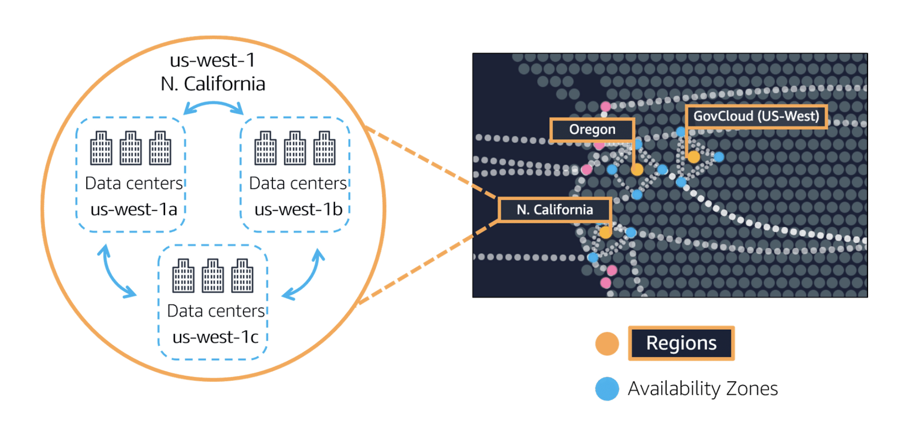

Content 
1. AWS Global Infrastructure
2. Regions
3. Availability Zones ( AZs )
4. Edge Locations

------------------------------------------------------------------------

1. AWS Global Infrastructure
   
   AWS Global Infrastructure ဆိုတာက Amazon Web Services (AWS) ကပေးတဲ့ Cloud Services တွေကို ကမ္ဘာတစ်ဝှမ်းမှာ ပျံ့နှံ့စွာ အသုံးပြုနိုင်အောင် တည်ဆောက်ထားတဲ့ နည်းပညာပုံစံပါ။ ဒီ Infrastructure က ကမ္ဘာတစ်ဝှမ်းမှာရှိတဲ့ Data Centers တွေကို တွဲဖက်ထားပြီး High Availability, Reliability, နဲ့ Performance ပိုင်းတွေမှာ စွမ်းဆောင်ရည်ကောင်းမွန်စေဖို့ ထောက်ပံ့ပေးပါတယ်။
   
   Notes: 
   
    1. AWS serves over a million active customers across more than 240 countries and territories.
    2. Achieve lower latency.
    3. Increase throughput.
    4. Ensure data residency within the specified AWS Region.
    5. AWS Cloud infrastructure is organized into **Regions** and **Availability Zones**.
    6. Regions : A physical location in the world containing multiple Availability Zones.
    7. **Availability Zones**: Comprise one or more data centers with redundant power, networking, and connectivity, located in separate facilities.
    8. AWS operates in 105 Availability Zones within 33 geographic Regions worldwide.
    9. Plans for more Availability Zones and Regions are in progress.
    10. Each Amazon Region is completely isolated from others, ensuring maximum fault tolerance and stability.
    11. Availability Zones within a Region are isolated but connected via low-latency links.

------------------------------------------------------------------------

2. Regions 
   
   Regions are geographically isolated areas, where you can access services needed to run your enterprise.
   
   AWS က ကမ္ဘာပေါ်မှာရှိတဲ့ Region တွေကို Customers တွေရဲ့ လိုအပ်ချက်ပေါ် မူတည်ပြီး တည်ဆောက်ထားပါတယ်။ Region တွေဆိုတာ ကမ္ဘာ့မြို့ကြီးတွေမှာ တည်ရှိနေတဲ့ Data Center အုပ်စုကြီးတွေကို ပြောတာပါ။ AWS ဟာ ဒီ Region တွေအားလုံးကို ထိန်းချုပ်ထားပြီး၊ တစ်ခုနဲ့တစ်ခုကို ချိတ်ဆက်ထားတာကြောင့် စနစ်တကျအလုပ်လုပ်နိုင်ပါတယ်။
  
   တကယ်လို့ သဘာဝဘေးအန္တရာယ်တစ်ခုခု ဖြစ်လာရင် မြို့တစ်မြို့မှာရှိတဲ့ Region မှာသာ ပြဿနာဖြစ်မှာမို့ များစွာသော ဒေတာတွေ အကုန်လုံးကို တစ်ပြိုင်နက်တည်း ဆုံးရှုံးရမယ်ဆိုတဲ့ အခြေအနေမျိုး မဖြစ်စေဖို့ Region တွေကို တစ်မြို့စီကွဲသွားအောင်ထားတာပါ။
   
   Regions ရွေးချယ်တဲ့ နေရာမှာ 
   
   1. Compliance with data governance and legal requirements
      
      Business requirement အရ သူတို့ လိုချင်တဲ့ နေရာ မှာ data ကို run ချင်ရင် လိုချင်တဲ့ နေရာမှာရှိတဲ့ Region ကို ရွေးချယ်ရပါမယ်။ ( ဥပမာ - UK မှာ data run ချင်ရင် Lodon region ) ကို ရွေးပေးရပါမယ်။
      
   2. Proximity to your customers
      
      Proximity ဆိုတဲ့ အတိုင်း အသုံးပြုမယ့် customer ရဲ့ အနီးစပ်ဆုံး Region ကို ရွေးချယ်ရပါမယ်။ ဥပမာ ကျွန်တော်တို့ နိုင်ငံ ဆိုရင်တော့ Singapore ပေါ့။
      
   3. Available services within a Region
      
       ကိုယ်လိုချင်တဲ့ Feature က ကိုယ်ရွေးချယ်ချင်တဲ့ Region မှာရှိချင်မှလည်း ရှိပါလိမ့်မယ်။
       
   4. Pricing

	  Services တွေက အတူတူပဲ ဆိုပေမယ့် သက်ဆိုင်ရာ Region အလိုက် Pricing ကွဲသွားတာမျိုးရှိပါတယ်။ ( ဥပမာ Brazil )
	  
------------------------------------------------------------------------

3. Availability Zones ( AZs )
   
   An Availability Zone is a single data center or a group of data centers within a Region.
   
   Availability Zones ဆိုတာက Region တစ်ခုရဲ့ အတွင်းမှာ သီးသန့် တည်ဆောက်ထားတဲ့ Data Centers တွေကို ပြောတာပါ။ AZ တစ်ခုခြားနားရင် Miles အနည်းငယ်အကွာမှာရှိပေမယ့် Network Latency က အရမ်းနည်းပါတယ်။ AZs တွေကို အသုံးပြုပြီး Application High Availability ကို မြှင့်တင်နိုင်ပြီး Disaster Recovery ပိုင်းမှာလည်း အရမ်းအသုံးဝင်ပါတယ်။
   
   
   ပုံမှာ ကြည့်မယ်ဆိုရင် data center us-west-1a / 1b / 1c ဆိုပြီး AZs သုံးခုရှိတယ်။ Nature disater ဆိုတာက ရှောင်ရှားလို့ မဖြစ်နိုင်တာကြောင့် instances တွေကို at least (2) AZs မှာ တည်ဆောက်ထားသင့်ပါတယ်။

------------------------------------------------------------------------

4. Edge Locations
   
   
   Edge Locations ဆိုတာက Content Delivery Network (CDN) နဲ့နီးစပ်တဲ့ Data Center Location တွေပါ။ AWS Edge Locations တွေက Data နဲ့ Content Delivery ကို မြန်ဆန်စေဖို့ CloudFront CDN နဲ့ ပူးပေါင်းပြီး ကမ္ဘာတစ်ဝှမ်းကို Server နီးနီးမှာ Delivery လုပ်ပေးပါတယ်။ ဒီ Services တွေကြောင့် User တွေအတွက် Latency နည်းပြီး Data ကို အမြန်ဆုံးရရှိနိုင်စေပါတယ်။
   
   Notes: 
   
   Edge Location is the Data Center used to deliver content fast to your users.
  
    1. The AWS Edge Locations uses a service called CloudFront.
    2. CloudFront is used to store cached copies of your content.
    3. Resulting in fast delivery of your content.

------------------------------------------------------------------------