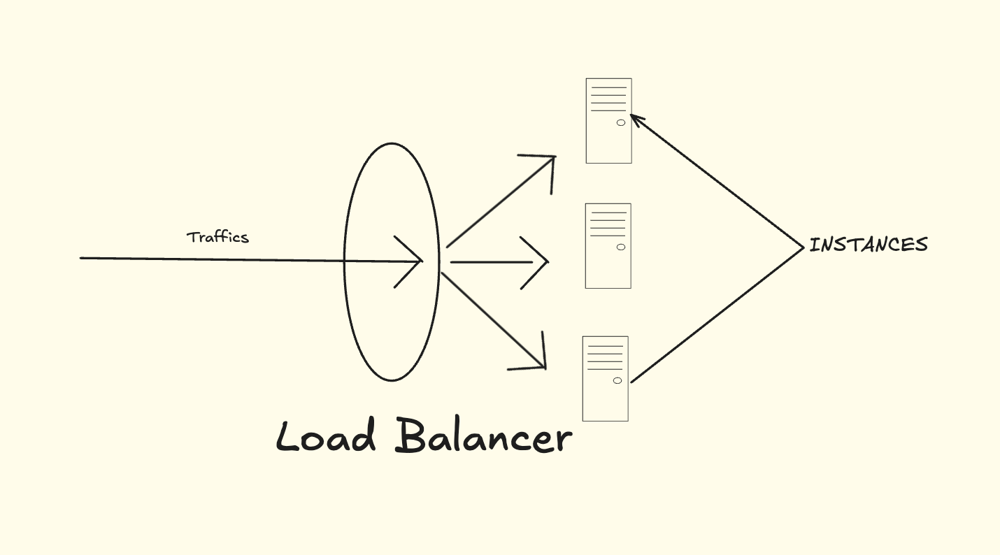
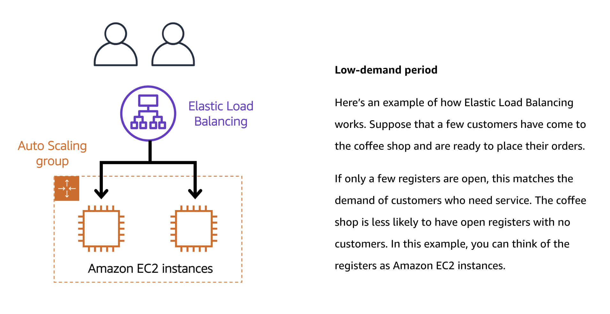

Content
1. Scaling
2. Load Balancing

------------------------------------------------------------------------
1. Scaling

	
  
    Scalability ကို System's elasticity ဆိုပြီး ဖော်ပြကြပါတယ်။ Website တစ်ခု Application တစ်ခု Run ကြတဲ့အခါ ကိုယ့် Website ကြီးလာတာနဲ့အမျှ Network Traffic တွေ တက်လာပြီး Server Crash တို့ Down သွားတာတို့ ဖြစ်သွားတယ်။ ဒီလိုကိစ္စမျိုးကို ကိုင်တွယ်ဖို့ ကိုယ်လိုချင်တဲ့ Demand အပေါ်မူတည်ပြီး အရေအတွက်များများနဲ့ သုံးမလား ။ တစ်ခုပဲ ဒါပေမယ့် အားကောင်းတဲ့ စက်တွေသုံးမလား ဆိုပြီး တော့ပေါ့။ 
  
	1. Vertical Scaling 
	   
	   Vertical Scaling တနည်းအားဖြင့် Scale up ဆိုပြီးခေါ်လို့ရတယ်။ CPU / Ram / Core စတဲ့ Resources တွေကို ရှိပြီးသား Instance တွေအပေါ်မှာ ထပ်ပြီး ပေါင်းထည့်လိုက်တာ။ တနည်းအားဖြင့် Upgrade မြှင့်လိုက်တာ​။ 
	   
	   Benefits of Vertical Scaling
	   
	    - Vertical Scaling ရဲ့ အရေးကြီးတဲ့ အချက်ကတော့ Concurrent User တွေအဆင်ပြေစေဖို့ပါ။ Cost effective အရကြောင့်လည်း ပြုပြင်ထိန်းသိမ်းတဲ့ အချိန်အပိုင်းခြား တစ်ခုအတွက် Vertical Scaling ကို သုံးကြပါတယ်။
	    - ကိုယ့် Website ကို လူဘယ်နှစ်ယောက်ကြည့်မလဲ။ Application ကိုဘယ်နှစ်ယောက်လာသုံးမလဲ စတဲ့ Traffic တွေကို ခန့်မှန်းလို့ မရနိုင်သေးတဲ့ အခြေအနေတွေအတွက်သင့်တော်တယ်။
	    - Single Node တစ်ခုထဲကနေ Handle တဲ့ အတွက် Response မြန်နိုင်တယ်။ Manage လုပ်တဲ့ အခါမှာလည်း Complexity သိပ်မရှိဘူး။

	   Disadvantages of Vertical Scaling
	   
	    - Single Node တစ်ခုထဲကနေပဲ Handle တာဆိုတော့ စက်ကြီး Down သွားရင် အကုန် Down သွားတယ်။ 
	    - Limitation Upgrade - Processing Power တို့ Ram တို့ ထပ်တိုးချင်တဲ့ အချိန်မျိုးမှာ ခန့်မှန်းထားတဲ့ Usage ထပ် စက်က စွမ်းဆောင်နိုင်တဲ့ Usage က ပိုနည်းနေတဲ့ အခါမျိုးမှာ အဆင်မပြေတော့ပါဘူး။ 

	2. Horizontal Scaling
	   
	   အပေါ်က ပြသာနာ တွေကိုဖြေရှင်းဖို့အတွက် Horizontal Scaling ကို သုံးလာကြတယ်။ Horizontal Scaling ဆိုတာက Instance အသစ်တွေ ထပ်ပွားလိုက်တာ။ ဆိုလိုချင်တာက တစ်ခုထဲ အဆင်မပြေတော့အတွက် စက်တွေ အများကြီးပွားပြီး တင်လိုက်တာပေါ့။ 
	   
	   Benefits of Horizontal Scaling
	   
	    - Vertical လို Single Node မဟုတ်ပဲ Multiple Nodes / Servers နဲ့ Handle လုပ်ပါတယ်။
	    - Server အသစ်တွေထပ်ထည့်ပြီး Scaling လုပ်တဲ့အခါမှာ Node အဟောင်းကို သွားပြီး Switch off လုပ်စရာမလိုတဲ့အတွက် Downtime သိပ်ပူစရာမလိုပါဘူး
	     
	   Disadvantages of Horizontal Scaling
	   
	    - "Multiple Servers are harder to maintain than single server". 
	    - Server အသစ်တွေ ဝယ်တဲ့ တစ်ချိန်မှာတော့ Cost တိုးနိုင်တယ်။

------------------------------------------------------------------------

2. Load Balancing 
   

   **Load Balancer** ဆိုတာက network traffic ကို balance ပြုလုပ်ပေးတဲ့ device (သို့) software တစ်ခုဖြစ်ပါတယ်။ ဥပမာပြောရရင်, website တစ်ခုကို ဝင်ကြည့်တဲ့ အသုံးပြုသူတွေ များလာတဲ့အခါ, server တစ်ခုတည်းကလွဲလို့ အခြား server တွေကနေတစ်ဆင့် ဝင်ကြည့်တဲ့ load ကိုဖြန့်ဝေပေးနိုင်တယ်။ ဒီလိုလုပ်ခြင်းက server တစ်ခုခုမှာ overload ဖြစ်မနေနဲ့, downtime ရှောင်ရှားနိုင်အောင် ကူညီပေးတယ်။

   Load Balancer က မိမိကိုယ်ပိုင် algorithm တွေကို အသုံးပြုပြီး traffic ကို balance လုပ်ပေးတယ်။ တချို့က round-robin, weighted round-robin, least connection, IP hash စတဲ့ methods တွေကို အသုံးပြုပါတယ်။

   Load Balancer ကို အသုံးပြုရခြင်းအရင်းခံမှာတော့,
    - Server တွေရဲ့ performance မနည်းပါဘူး။
    - Redundancy လုပ်ပေးနိုင်တယ်။
    - High availability (HA) ရနိုင်တယ်။

   ပုံမှန်အားဖြင့် Load Balancer တွေကို layer 4 (Transport layer) နဲ့ layer 7 (Application layer) မှာ တွေ့ရတယ်။ Web application တွေမှာ မရှိမဖြစ်လိုအပ်တဲ့ device (သို့) service တစ်ခုဖြစ်တာကြောင့် စနစ်တကျ စဉ်းစားတတ်ဖို့ လိုအပ်ပါတယ်။

   Examples of Elastic Load Balancing

   

   

------------------------------------------------------------------------

Notes: 

1. Storage Optimized is suitable for data warehousing applications.
2. General Purpose balances compute, memory, and networking resources.
3. Memory Optimized is ideal for high-performance databases.
4. Compute Optimized offers high-performance processors.
5. Standard Reserved Instances provides a discount when you specify a number of EC2 instances to run a specific OS, instance family and size, and tenancy in one Region.
6. EC2 Instance Savings Plans provides a discount when you make an hourly spend commitment to an instance family and Region for a 1-year or 3-year term.

------------------------------------------------------------------------