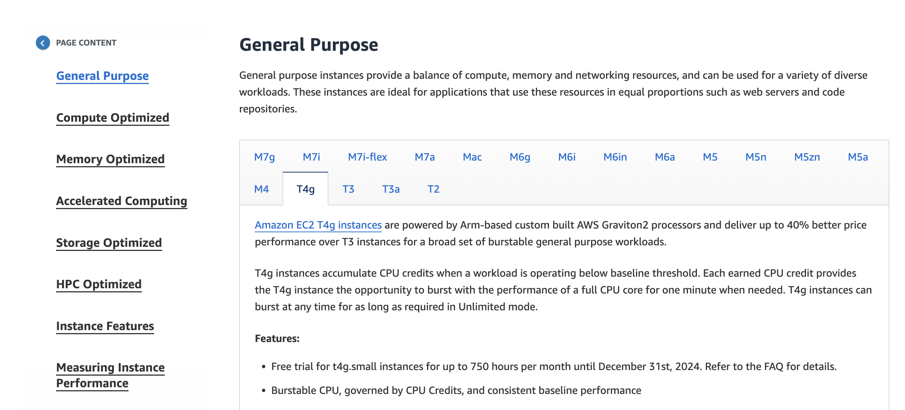

Content

1. EC2 Instance Type
2. Amazon EC2 Instance Families
3. EC2 Pricing
4. Knowledge Check

------------------------------------------------------------------------

- EC2 Instance Type
  
  1. Each Amazon EC2 instance type is grouped under EC2 instance family.
  2. Amazon EC2 provides us with the wide selection of instance types that are optimized for different use cases.
  3. Instance types comprises of varying combinations of CPU, memory, storage and networking capacity and this gives us the flexibility to choose the most appropriate mix of resources for the applications.
  4. Each instance type includes one or more instance sizes, that allows us to scale the resources to the requirements of the target workloads.
  5. The instance types can be divided into following,

------------------------------------------------------------------------

- Amazon EC2 Instance Families 
  
  Instance Type ရွေးတဲ့ နေရာမှာ ကိုယ့် Application ရဲ့ Requirements ပေါ်မူတည်ပြီး ဘာသုံးမလဲဆိုတာ ရွေးချယ်ရပါတယ်။ 
  
  

	1. General Purpose
   
	   General Purpose မှာက Balance Resources (Compute + Memory + Networking) ဆိုပြီး ထုတ်ပေးထားတဲ့ အမျိုးအစားပါ။ Web Server လိုမျိုး Code Repositories လိုမျိုးတွေအတွက် အသုံးပြုလို့ကောင်းပါတယ်။ 
   
	   Instance Series အနေနဲ့က M series နဲ့ T series ဆိုပြီးရှိပါတယ်။ AWS မှာ Free tier အနေနဲ့ T2 micro ဆိုပြီး ပေးထားတာ ရှိပါတယ်။
   
	2. Compute Optimized
   
	   Compute ဆိုထဲက Intensive Tasks တွေ တွက်ချက်ဖို့ Processing Power ခပ်မြင့်မြင့် သုံးနိုင်မယ့် High Performance Processors အမျိုးအစားဖြစ်ပါတယ်။ ဖော်ပြထားတာအရ Media transcoding တွေ Gaming Servers တွေ Machine Learning Inference တွေ Scientific Modeling တွေ စွမ်းဆောင်ရည်မြင့်မားပြီး တွက်ချက်မှုတွေလုပ်ရတဲ့ High performance computing (HPC) တွေအတွက် သုံးရန်သင့်တော်ပါတယ်။ 
   
	   Instance Series အနေနဲ့က C series ဆိုပြီးရှိပါတယ်။ 

	3. Memory Optimized
   
	   Memory ဦးစားပေး အမျိုးအစားဖြစ်ပြီး Data ( Read / Write ) အတွက်သင့်တော်ပါတယ်။ 
	   Abilities 
		   - Fast Performance
		   - Large Dataset of Memories
		   - Open Sources Databases
		   - In-memory caches
		   - Real-time big data analytics
	     
	   Instance Series အနေနဲ့က Z series, High Memory, X series, R series ဆိုပြီးရှိပါတယ်။ 
   
	4. Accelerated Computing
   
	   Application performance ကို smoothly run နိုင်ဖို့ CPU load လျော့ချပေးတဲ့ စွမ်းဆောင်ရည်မြင့်ပြီး one specific job နဲ့ အလုပ်လုပ်တဲ့ Hardware Acceleration (co-processors) တွေ အသုံးပြုထားတဲ့အတွက် floating-point number calculations, graphics processing, game streaming တွေအတွက် သင့်တော်ပါတယ်။ 
   
	   Instance Series အနေနဲ့က V series, F series, D series, Inf series, Trn1, G series, P series ။ 
   
	5. Storage Optimized
   
	   large datasets တွေအတွက် Read / Write တို့ 
	   tens နဲ့ ချီတဲ့ I/O process တွေလုပ်တဲ့ အချိန်မှာ Latency လျော့ချချင်တဲ့ အချိန်၊ 
	   ရှုပ်ထွေးတဲ့ Transaction တွေ ရှိလာတဲ့ အချိန် Data ကိုမြန်မြန်ရယူသုံးစွဲချင်တဲ့အခါမျိုးတွေ အတွက်သင့်တော်ပါတယ်။
   
		   - distributed file systems
		   - data warehousing applications
		   - high-frequency online transaction processing (OLTP) systems
		   - input/output operations per second (IOPS)
     
	    Instance Series အနေနဲ့က H series, D series, I seriers
    
	6. HPC Optimized 
   
	   ဈေးကြီးသလောက် အရည်အသွေးမြင့်မြင့် သုံးနိုင်ဖို့လိုတဲ့ လုပ်ငန်းတွေအတွက် ရည်ရွယ်တယ်။ ကြီးကြီးမားမား ရှုပ်ရှုပ်ထွေးထွေး တွက်ချက် အဖြေထုတ်ရမယ့် လုပ်ငန်းတွေ သုံးသင့်တယ်။
   
	   Instance Series : Hpc series

------------------------------------------------------------------------
- EC2 Pricing

	1. On Demand
	   
	   ကိုယ်သုံးမယ့် Operation System ၊ Instance type ပေါ်မူတည်ပြီး Run အခါ Duration (hr, min, s) အလိုက် cost တွက်ပါတယ်။ EC2 စဖွင့်ရင်တော့ On Demand နဲ့ပဲ သုံးရမှာပါ။ ဒီအတွက်ကြောင့် Long-term payment တွေ upfront payment ( ငွေကြိုပေး ) တာတွေ မလိုပါဘူး။ ဒီ Instance ကိုတေ Short-term application တွေ ၊ developing ၊ testing app တွေ unpredictable usage ( ခန့်မှန်းရမလွယ်ကူနိုင်တဲ့ App ) တွေအတွက် သုံးသင့်ပြီး Yearly အလိုက် Plan ထားတဲ့ Long-term project တွေအတွက်တော့ မသုံးသင့်ပါဘူး။
	   
	2. Reserved Instances
	   
	   ဒီ Instance ကတော့ Long-term application run ချင်တဲ့အချိန်မျိုး ၊ steady-state workload ရှိထားပြီးတဲ့ App မျိုး ၊ usage ကို ကြိုတင်သတ်မှတ်ထားပြီး သေချာတဲ့ အခါမျိုးမှာ သုံးသင့်တယ်။ Long-term အတွက်ဖြစ်တဲ့အတွက် Payment အနေနဲ့က one or three year အထိ စာချုပ်ချုပ်ဖို့ လိုအပ်ပါတယ်။ 
	   
	   Payment Options တွေ အနေနဲ့က 
	
	   1. All Upfront : One or three year အတွက် ကြိုပြီး အလုံးလိုက်ငွေချေလိုက်တာပါ။ ဒီလိုပေးလိုက်ချင်းအားဖြင့် Monthly အလိုက်ပေးချေရာမှာ သက်သာသွားပါတယ်
	   2. Partial Upfront : Instances အတွက် စုစုပေါင်းကုန်ကျစရိတ်ထဲကနေ 50% ကြိုပေးရပါတယ်။ ကျန်တဲ့ 50% ကိုတော့ hourly / monthly ခွဲပေးလို့ရပါတယ်။ 
	   3. No Upfront : Software Development Company တစ်ခုရှိတယ်ဆိုကြပါစို့။ Project duration ကလည်း 1 year ရှိမယ်။ Company budget ကလည်း မတတ်နိုင်တဲ့ အခါမျိုးမှာဆိုရင် No Upfront Payment Option ကို သုံးကြပါတယ်။ ကြိိုတင်ပြီး ပေးစရာမလို။ ခွဲပေးစရာလည်း မလိုပဲ သူ Discount ပေးထားတဲဲ့ အတိုင်း Hourly အလိုက်ပေးချေရုံပါပဲ။ အနည်းဆုံးတော့ 1 year contract တော့ ချုပ်ရပါတယ်။
	      
	   RI / Reserved Instances Type (3) မျိုးရှိတယ်။ 
	   
	   1. Standard : Steady-state usage တွေအတွက် အထူးသင့်တော်ပြီး On-demand pricing ထပ် ( up to 72% off ) သက်သာပါတယ်။ AWS ရဲ့ Reserved Instance Marketplace မှာ တင်ပြီးလည်း ပြန်ရောင်းတာ / ပြန်ဝယ်တာ တို့လည်း ရပါသေးတယ်။
	   2. Convertible : RI attributes တွေကို တိုးလိုက်တာတို့ ညီလိုက်တာတို့ (​equal) စသည်ဖြင့်ပြောင်းလိုက်လို့ရပါတယ်။ သူလည်းပဲ Steady-stage usage တွေအတွက် သင့်တော်ပြီး On-demand ထပ် ( up to 54% off ) သက်သာပါတယ်။
	   3. Schedule : ဒီ RIs ကတော့ Schedule ဆိုတဲ့ အတိုင်း ကိုယ်လိုချင်တဲ့ အချိန် ( Specific time )မှာ Compute capacity အသုံးပြုမယ်ဆိုပြီး သတ်မှတ်လို့ရပါတယ်( တစ်ပတ်မှာ ဘယ်နှစ်နာရီပဲ သုံးမယ် )။ 

	3. Spot Instance Type
	   
	   ဒီ Instance type မှာတော့ On-demand ထပ် ( Up to 90% off ) သက်သာပါတယ်။ ဘယ်လိုအလုပ်လုပ်လည်းဆိုတော့ Flexible start and end times ဆိုပြီးလုပ်ပါတယ်။ ဥပမာ Background Processing တစ်ခုရှိတယ်။ အဲ့ဟာက Customer survey တို့ Video transcoding တို့ ဒီလိုမျိုး လုပ်တဲ့အချိန်မှာ Instance ကိုဖွင့်မယ် ( start )။ Processing ပြီးတာနဲ့ ပိတ်မယ် ( end )။ 
	   
	   တစ်ခုရှိတာကတော့ ကျွန်တော်တို့က spot request လုပ်မယ်။ Computing Capacity ကလည်း Available ဖြစ်တယ်ဆို Instance Launchသွားမယ်။ Available မဖြစ်ဘူးဆိုရင်တော့ Background Processing Delay ဖြစ်တာမျိုး ဖြစ်နိုင်ပါတယ်။ ဒါမှမဟုတ် Provider ဖြစ်တဲ့ AWS က လုံးဝပိတ်လိုက်တဲ့အခါမျိုးမှာဆိုရင်တော့ Processing time က ကြာခဲ့တဲ့ အချိန်အလိုက်ပိုက်ဆံပေးစရာမလိုပါဘူး။ ဒီလိုမျိုးကို ရှောင်ရှားချင်ရင်တော့ တခြား EC2 Instance types တွေကို ရွေးချယ်ရတော့မှာပါ။ 
	   
	4. Dedicated Instance ( or ) Hosting
	   
	   ဒီတစ်ခုကတော့ Physical Server တစ်မျိုးဖြစ်ပြီး စျေးအကြီးဆုံးအမျိုးအစားလည်း ဖြစ်ပြီးတော့ ကိုယ်ပိုင် သီးသန့် Dedicated Server Host ထားပေးထားပါတယ်။ သီးသန့် host ထားပေးထားတဲ့အတွက်ကြောင့် System Security Concern အရလည်း စိတ်ချရတယ်။ On-demand ထပ် ( Up to 70% off ) ပေးပါတယ်။ 

	5. Saving Plans
	   
	   AWS Savings Plans ကတော့ AWS Usage (Compute Usage) ကို တချိန်တည်းမှာ စရိတ်သက်သာစေတဲ့ Flexible Pricing Model တစ်ခုဖြစ်ပါတယ်။ သုံးစွဲမယ့် Resources တွေ အတွက် Usage Cost (USD per hour) ကို 1 နှစ် ဒါမှမဟုတ် 3 နှစ်အထိ ကျရင်အနေအထားကို Commitment လုပ်ပေးရပြီး On-Demand Pricing ထက် 72% အထိသက်သာစေပါတယ်။ Savings Plans က Reserved Instances ထက်ပိုပြီး Flexible ဖြစ်ပြီး Regions, Instance Types, Services များအကြား Discount ကို သက်ရောက်စေမှာဖြစ်ပါတယ်။
	   
	   Saving Plans အမျိုးအစားများ
	   
	   1. Compute Savings Plans : EC2 Instances များအပြင် AWS Fargate နဲ့ AWS Lambda Usage တွေအားလုံးအတွက် အကျုံးဝင်ပါတယ်။ Region, Instance Type, Operating System, Tenancy တို့မရွေး အကုန်သက်ရောက်ပါတယ်။ On-Demand Pricing ထက် 66% အထိသက်သာစေပါတယ်။
	      
	   2. EC2 Instance Savings Plans: အသုံးပြုမှုကို Region တစ်ခုအတွင်းမှာ အထူးပြုထားတဲ့ Instance Family တစ်ခုတည်း အတွက် Commitment လုပ်ပေးရပါတယ် (ဥပမာ M5 usage in N. Virginia တို့)။ အဲ့ဒီ Savings Plans က AZ, Instance Size, Operating System (OS), သို့မဟုတ် Tenancy အရ အလိုအလျှောက် စျေးနှုန်းလျော့ပါတယ်။
	   
------------------------------------------------------------------------

Knowledge Check 

1. Q: Which Amazon EC2 instance type is suitable for data warehousing applications?
   A: Storage Optimized
   
2. Q: Which Amazon EC2 instance type balances compute, memory, and networking resources?
   A: General Purpose
   
3. Q: Which Amazon EC2 instance type is ideal for high-performance databases?
   A: Memory Optimized
   
4. Q: Which Amazon EC2 instance type offers high-performance processors?
   A: Compute Optimized

5. Q: Which Amazon EC2 pricing option provides a discount when you specify a number of EC2 instances to run a specific OS, instance family and size, and tenancy in one Region?
   A: Standard Reserved Instances

6. Q: Which Amazon EC2 pricing option provides a discount when you make an hourly spend commitment to an instance family and Region for a 1-year or 3-year term?
   A: EC2 Instance Savings Plans