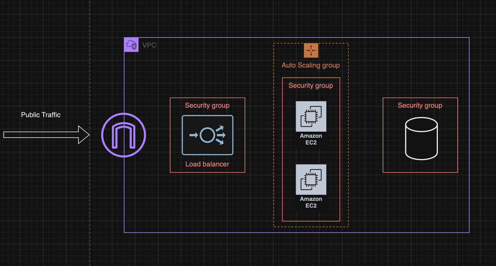
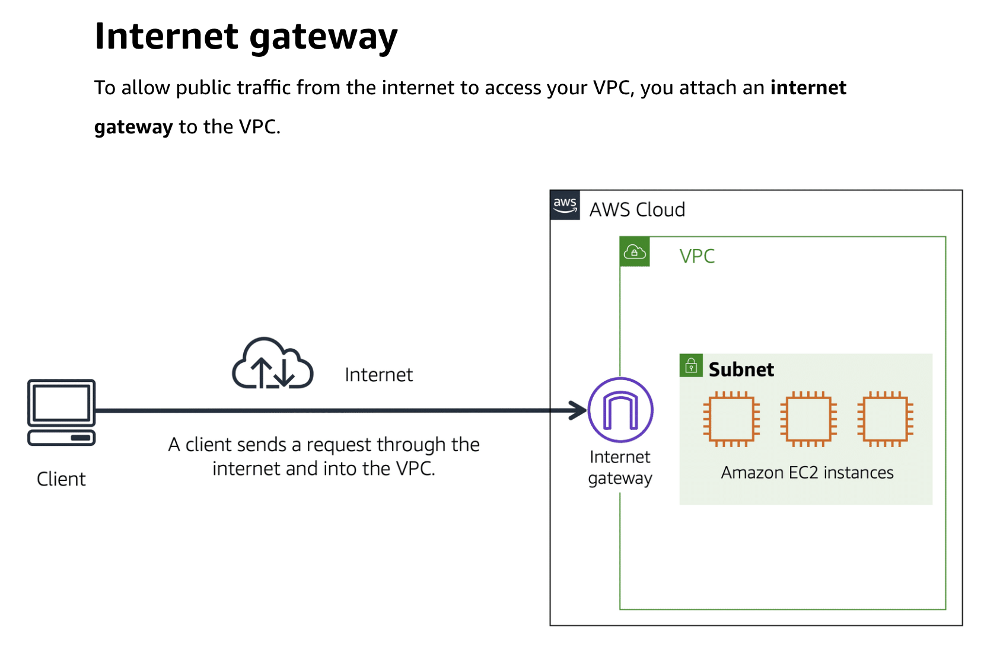
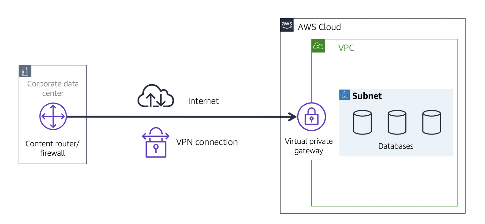
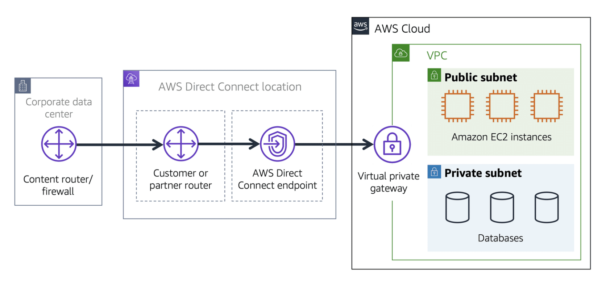
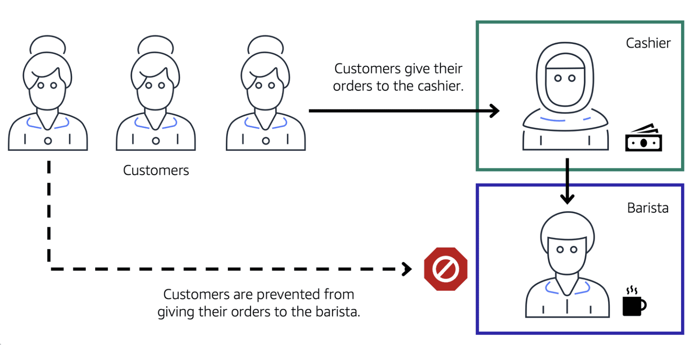
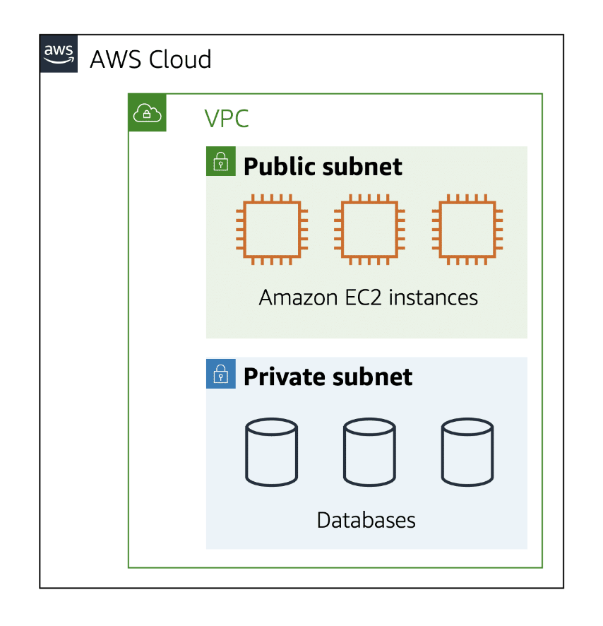

Content
1. Amazon Virtual Private Cloud ( Amazon VPC )
2. Internet Gateway
3. Virtual Private Gateway
4. AWS Direct Connect
5. Subnets
	1. Public
	2. Private
6. Network ACLs (Network Access Control Lists) and Security Groups
	1. Network ACLs 
	2. Security Groups

------------------------------------------------------------------------
1. Amazon Virtual Private Cloud ( Amazon VPC )

  
  
  Amazon VPC (Virtual Private Cloud) ဆိုတာက cloud environment အတွင်းမှာ organization အတွက် network တစ်ခုကို သီးသီးသန့်သန့် ရရှိစေတဲ့ service ဖြစ်ပါတယ်။ VPC ကိုအသုံးပြုရင် သင့် application တွေ၊ database တွေ၊ တခြား resources တွေကို securely isolate (သီးခြားထား) နိုင်ပါတယ်။ 

  VPC ကို လိုအပ်ချက်အရ configure လုပ်နိုင်ပြီး IP address range, subnets, route tables, internet gateways စတာတွေကို manage လုပ်နိုင်ပါတယ်။ VPC အတွင်းမှာ ရတဲ့ private IP space ကို သီးသန့် configure လုပ်နိုင်ပြီး public-facing services တွေကို public subnet ထဲမှာ ထားနိုင်သလို, sensitive data တွေကို private subnet ထဲမှာ secure စောင့်ရှောက်ထားနိုင်ပါတယ်။

  VPC အသုံးပြုရင် security အတွက် အထူးသင့်တော်ပြီး, Network Access Control Lists (NACLs) နဲ့ Security Groups တွေ သုံးပြီး inbound, outbound traffic တွေကို strict control နိုင်ပါတယ်။ Plus, VPN (Virtual Private Network) သုံးပြီး on-premises network တွေနဲ့ securely connect နိုင်ပါတယ်။

  ဘယ်လို VPC setup လုပ်ရလဲဆိုတာ မိတ်ဆက်ပြောရင် — တစ်ခုကို Public Subnet နဲ့ Private Subnet နှစ်ခုနဲ့ configure လုပ်နိုင်ပြီး Public Subnet ထဲမှာ web server လို service တွေကိုထားပြီး Private Subnet ထဲမှာ database ကိုထားတာမျိုးဖြစ်ပါတယ်။

  VPC က AWS infrastructure ထဲမှာ flexibility နဲ့ security ရရှိအောင် setup လုပ်ဖို့အတွက် အထူးအရေးကြီးတဲ့ tool တစ်ခုပါ။

------------------------------------------------------------------------

2. Internet Gateway
 

 Internet Gateway ကတော့ Public Internet နဲ့ VPC ချိတ်ထားတဲ့ Connection တစ်ခု ဖြစ်ပါတယ်။ 

------------------------------------------------------------------------

3. Virtual Private Gateway
 

 On-premise data center တွေ internal corporate network စတဲ့ Private Network တွေနဲ့ VPC ကိုချိတ်တဲ့ လမ်းကြောင်းမှာ VPN Connection ချိတ်ဆက်အသုံးပြုပါတယ်။

------------------------------------------------------------------------

4. AWS Direct Connect
 
 
  Direct Connect က Dedicated Connection တစ်ခုဖြစ်ပြီး On-premise network နဲ့ VPC ကြား တိုက်ရိုက်ချိတ်ပေးတာပါ။ Dedicated ဖြစ်တဲ့ အတွက် Latency နည်းပြီး Public internet က ဖြတ်မသွားတဲ့ အတွက် လုံခြုံပါတယ်။

------------------------------------------------------------------------

5. Subnets

 Coffee ဆိုင်တစ်ခုမှာ customer တွေက Cashier စီမှာ အရင်မတန်းစီပဲ Brista စီတန်းပြီး သွားတန်းစီနေသလိုမျိုးတွေ ရှိလာနိုင်မယ်။ ဒီအခြေနေကို ဘယ်လိုထိန်းမလဲ။ ဒါဆိုရင် Brista စီတန်းသွားလို့ မဖြစ်အောင် Security ထားလိုက်မယ်။ Cachier အပိုင်းကို Public Facing ထားပြီး Brista ကို Private ထားလိုက်မယ်။ ( ဒါက Instance နှစ်ခုလို့ မြင်လို့ရမယ့် Cashier နဲ့ Brista ကို subnet အုပ်လိုက်တာ ) 

 ဒီလိုမျိုးပဲ ကျွန်တော်တို့ Client စီကနေ request တွေ ဝင်လာမယ်။ ဝင်လာမယ့် Request တွေကို Instance စီမရောက်ခင် VPC ခံထား။ ဒီနေရာမှာ request တွေ ဝင်လာလို့ ရအောင် Internet gateway လို့ခေါ်တဲ့ တံခါးရှိတယ်။ Client / internet / Instance ကြားထဲက လမ်းလို့ ပြောလို့ရတယ်။
   

  Subnets ဆိုတာက **VPC (Virtual Private Cloud)** အတွင်းက network ကိုပိုမို အားကောင်းအောင် logical groupings အဖြစ် သတ်မှတ်ထားတဲ့ small networks လေးတွေ ဖြစ်ပါတယ်။ VPC အတွင်းမှာ Subnet တွေကို သီးသန့်ဖြစ်အောင် configure လုပ်နိုင်ပါတယ်။

   

 Subnets ကို အခြေခံပြီး **Public Subnet** နဲ့ **Private Subnet** ဆိုပြီး ခွဲကြပါတယ်။

 1. **Public Subnet**:  
   Public Subnet ဆိုတာက Internet နဲ့ တိုက်ရိုက်ချိတ်ဆက်ထားတဲ့ Subnet ဖြစ်ပါတယ်။ Web servers, Load Balancers လို Public-facing services တွေကို ဒီ Subnet ထဲမှာထားတတ်ကြပါတယ်။ Public Subnet ထဲမှာရှိတဲ့ instances တွေဟာ Internet Gateway နဲ့ ချိတ်ဆက်ထားပြီး, public IP addresses တွေ ရရှိမှာဖြစ်ပါတယ်။

 2. **Private Subnet**:  
   Private Subnet ဆိုတာက Internet နဲ့ တိုက်ရိုက်မချိတ်ဆက်ဘဲ အခြား Subnets, အခြား on-premises networks တွေနဲ့ပဲချိတ်ဆက်ထားတဲ့ Subnet ဖြစ်ပါတယ်။ Database servers, အခြား sensitive data တွေကို Private Subnet ထဲမှာ ထားတတ်ကြပါတယ်။ Internet အပြင်ပေါ်ကနေ access လုပ်လို့မရဘဲ internal services တွေကနေသာ access လုပ်နိုင်အောင် setup လုပ်ရတာပါ။

 Subnets ကို configure လုပ်ရာမှာ CIDR (Classless Inter-Domain Routing) block တွေသုံးပြီး IP address range တွေကို assign လုပ်ရပါတယ်။ Subnet တစ်ခုချင်းစီက IP address range တစ်ခုကို သီးသန့်ပိုင်ဆိုင်ထားပြီး, VPC အတွင်းမှာရှိတဲ့ အခြား Subnets နဲ့ IP conflict မဖြစ်အောင် သတ်မှတ်ထားပါတယ်။

 Subnets တွေကို effectively အသုံးပြုပြီး VPC အတွင်းက network traffic ကို control လုပ်နိုင်ပါတယ်။ Security အတွက်တော့, Security Groups နဲ့ NACLs (Network Access Control Lists) တွေကို သီးခြားသတ်မှတ်ပြီး Subnet အသီးသီးအတွက် inbound/outbound traffic rules တွေ configure လုပ်နိုင်ပါတယ်။

------------------------------------------------------------------------

6. **Network ACLs (Network Access Control Lists)** and Security Groups
   
   **Network ACLs (Network Access Control Lists)** နဲ့ **Security Groups** က AWS VPC (Virtual Private Cloud) အတွင်းမှာ network security ကို ထိန်းချုပ်ဖို့ အတွက် အဓိကပါဝင်တဲ့ tools တွေပါ။
   
   1. **Security Groups**
      
      Security Groups ဆိုတာက instance (ဥပမာ EC2) တစ်ခုချင်းစီအပေါ်မှာ လုပ်ဆောင်နိုင်တဲ့ virtual firewall လို့ပြောလို့ရပါတယ်။ Security Groups ကတော့ **instance level** မှာပဲ focus လုပ်ပြီး, inbound (အဝင်) နဲ့ outbound (အထွက်) traffic တွေကို control လုပ်ပေးပါတယ်။

	- **Inbound Rules**: ဘယ် IP address, port, protocol လမ်းကြောင်းတွေကနေ ထဲကို traffic ဝင်ခွင့်ပြုမလဲ သတ်မှတ်ပေးနိုင်တယ်။
	- **Outbound Rules**: ဘယ် IP address, port, protocol လမ်းကြောင်းတွေကို ထွက်ခွင့်ပြုမလဲ သတ်မှတ်ပေးနိုင်တယ်။
	  
	  Security Groups ဟာ **stateful** ဖြစ်ပါတယ်။ ဒီအကြောင်းအရာအရ, အဝင် traffic လက်ခံရင် အထွက် traffic ကို မူတည်ပြီး စစ်ဆေးရမှာမဟုတ်ဘူး။ ရှေ့မှာ ဗလာအနေအထားထားပြီးရင်လည်း, သတ်မှတ်ထားတဲ့ rules များအတိုင်း ခွင့်ပြုတာပါ။
   
	   1. Security Groups တွေဟာ stateful ဖြစ်ပါတယ် (အဝင် traffic လက်ခံရင်, အထွက် traffic ကိုလည်း auto ခွင့်ပြုတယ်)။
	   2. တစ်ခါတစ်ရံတွင် instance တစ်ခုက အများကြီး Security Groups ကိုလက်ခံနိုင်တယ်။
	   3. Rules တွေဟာ allow rules (ခွင့်ပြုတဲ့ အချို့သော traffic) တွေပါ။ 
        
   2. **Network ACLs (NACLs)**
      
      Network ACLs ဆိုတာက Subnet-level မှာ control လုပ်တဲ့ firewall လို့ပြောလို့ရပါတယ်။ NACLs ကတော့ **Subnet level** မှာ focus လုပ်ပြီး, inbound နဲ့ outbound traffic တွေကို control လုပ်ပေးပါတယ်။

	- **Inbound Rules**: ဘယ် traffic လမ်းကြောင်းတွေက Subnet ထဲကို ဝင်ခွင့်ပြုမလဲ သတ်မှတ်ပါတယ်။
	- **Outbound Rules**: ဘယ် traffic လမ်းကြောင်းတွေက Subnet ထဲက ထွက်ခွင့်ပြုမလဲ သတ်မှတ်ပါတယ်။
	  
	  NACLs က **stateless** ဖြစ်ပါတယ်။ inbound နဲ့ outbound traffic တွေကို သီးသန့်စီစစ်ပြီး control လုပ်ရပါတယ်။ 
   
	   1. NACLs တွေဟာ stateless ဖြစ်ပါတယ် (inbound နဲ့ outbound traffic အပေါ်မှာ rules တွေကို သီးသန့်စီစစ်ပြီး control လုပ်တယ်)။
	   2. Subnet တစ်ခုမှာ NACL တစ်ခုပဲရှိနိုင်တယ်။
	   3. Rules တွေဟာ allow (ခွင့်ပြုတဲ့ traffic) နဲ့ deny rules (မခွင့်ပြုတဲ့ traffic) လို့ခွဲခြားထားပါတယ်။

------------------------------------------------------------------------

